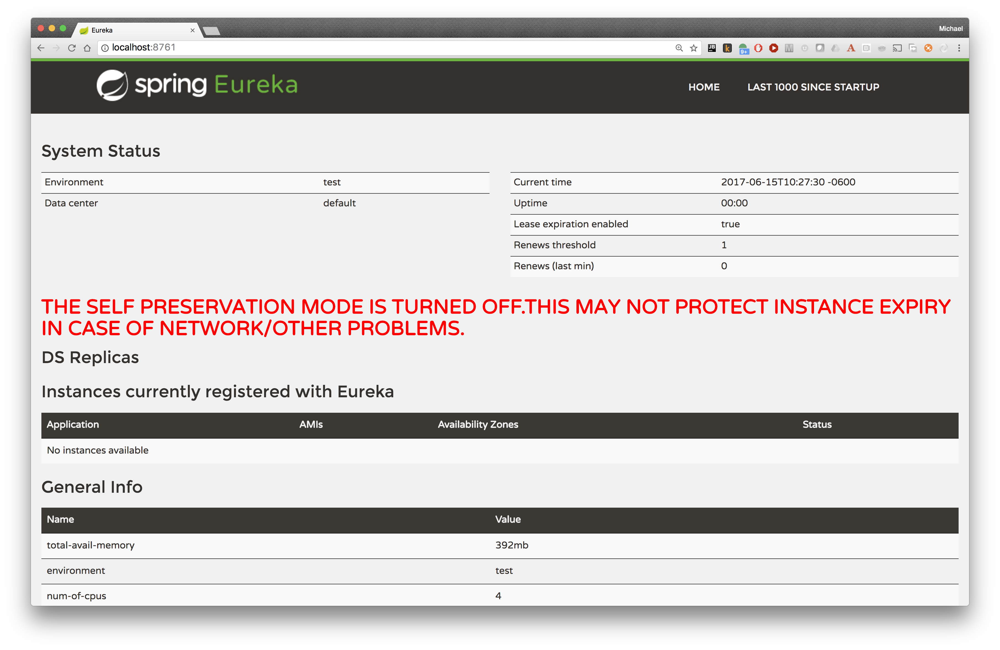

# Overview
The 'platform.training.ribboneureka-server' project demonstrates a service registering with Eureka so other services can discover and access it.

It is a Spring Boot microservice that uses Spring Cloud Netflix for Netflix OSS Eureka service registration
			  

## How to Build

	$ gradle clean build
	
## How to run

### Start Eureka Discover Service

First download build and start the `platform.shared.discoveryservice` located at: https://github.com/EBSCOIS/platform.shared.discoveryservice

Make sure you can access the Eureka Dashboard at: http://localhost:8761

### Start 'ribboneureka-server' Service

    $ gradle bootRun
    
Ensure the service is now registered in Eureka:

The console output will display a message indicating successful registration:

    2017-06-15 10:43:02.225  INFO 78880 --- [nfoReplicator-0] c.n.d.DiscoveryClient : DiscoveryClient_PLATFORM.SHARED.RIBBONEUREKADEMO.SEARCHSERVICE/platform.shared.ribboneurekademo.searchservice - registration status: 204
    
Look for the 'registration status: 204' indicating registration success.

You can also view the service registration in the Eureka Dashboard at: http://localhost:8761/

## How to access

The service is available on port 8088.

http://localhost:8088/search/mysearch

The response simply echos back the last token of the URL in a JSON body.

    {
        response: "mysearch-result"
    }
